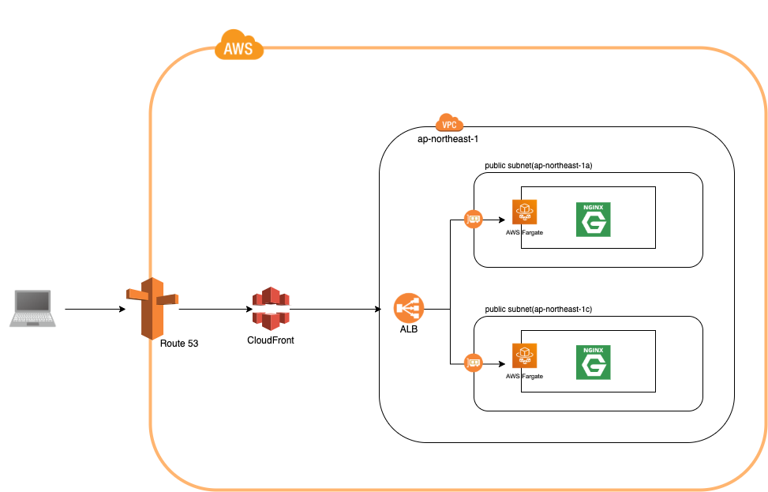

# Fargate Infrastructure CF Template

This is CloudFormation Template for the AWS infrastructure of ECS Fargate.
You can deploy your own Service with Serverless Container Orchestration.

## Environment

- Route53
- CloudFront
- VPC
- Public Subnet
- Application Load Balancer
- ECS Fargate

## Architecture



## Directory Design

- root.yml ... Root Stack
- templates/ ... Stack of S3Bucket for yaml templates
- infrastructure/ ... Stacks of network settings
- ecs-fargate/ ... Stacks of ECS Fargate

## How to Use

### 1.set your environment variables on .env

.env
```
APP_NAME=sample-api
TEMPLATE_BUCKET=sample-templates
VPC_CIDR=192.168.0.0/16
PUBLIC_SUBNET_A_CIDR=192.168.0.0/20
PUBLIC_SUBNET_C_CIDR=192.168.16.0/20
PRIVATE_SUBNET_A_CIDR=192.168.32.0/20
PRIVATE_SUBNET_C_CIDR=192.168.48.0/20
HEADER_KEY=sample
DOMAIN_NAME=sample.com
SUB_DOMAIN=api
CFSSLCertificateId=xxxxx-yyyy-zzzz
```

### 2.login with your AWS account

```
$ aws configure
```

### 3.deploy S3 Bucket for templates

```
$ sh template
```

### 4.deploy your service

ENV ... prd | something

```
$ sh deploy ENV
```

### 5. Go To your console and Try it!

enjoy serverless life!